# rPPG Stress Estimation Project


Academic pipeline for estimating physiological stress from facial videos using remote photoplethysmography (rPPG).

## System Flowchart

```mermaid
graph TD
    START(("Start"))

    START --> INPUT["<b>Input:</b> Facial Video Recording<br/>(UBFC-Phys Dataset, N Subjects)"]

    INPUT --> SCENARIO["<b>Scenario Setting:</b><br/>Physiological Conditions<br/>(Rest/T1, Speech/T2, Arithmetic/T3)"]

    SCENARIO --> LANDMARK["478 Facial Landmark Mapping<br/>(MediaPipe FaceLandmarker)"]

    LANDMARK --> ROI["Facial ROI Isolation via<br/>Per-Region Polygon Boundary Masking<br/>(Forehead, Left Cheek, Right Cheek)"]

    ROI --> SKIN["Skin Filtering via<br/>BGR to YCrCb Color Space Conversion"]

    SKIN --> MEAN_RGB["Spatial RGB Average Computation<br/>of Valid Skin Pixels per Frame"]

    MEAN_RGB --> POS["Raw BVP Signal Extraction<br/>via POS Algorithm<br/>(1.6s Overlap-Add Windowing)"]

    POS --> BPF["Signal Filtering<br/>(Butterworth Bandpass Filter<br/>0.7 – 4.0 Hz, Order 4, Zero-Phase SOS)"]

    BPF --> SEG["Signal Segmentation<br/>(60s Sliding Window, 10s Step)"]

    SEG --> PEAK["Peak Detection &<br/>IBI Boundary Validation (0.30 – 2.00s)"]

    PEAK --> BEAT_CHECK{"Beat Count<br/>≥ 10?"}

    BEAT_CHECK -- Yes --> FEAT["Multi-Domain PRV/HRV<br/>Feature Computation"]
    BEAT_CHECK -- No --> FEAT_NAN["Set PRV/HRV Features = NaN"]

    FEAT --> QC{"Signal Quality<br/>> 0.60?"}
    FEAT_NAN --> QC

    QC -- No --> OUT_POOR["Output: Poor Signal"]
    QC -- Yes --> DET{"Detection Rate<br/>≥ 0.90?"}

    DET -- No --> OUT_FACE["Output: Face Not Stable"]
    DET -- Yes --> RF["Stress Level Classification<br/>(Random Forest, 300 Trees)<br/>Pipeline: Imputer → Scaler → RF"]

    RF --> CONF{"Confidence ≥ 0.60<br/>AND Quality ≥ 0.70?"}

    CONF -- Yes --> OUT_FINAL["<b>Final Classification Output:</b><br/>Normal / Moderate / High Arousal"]
    CONF -- No --> OUT_UNCERTAIN["Output: Uncertain"]

    OUT_FINAL --> DISPLAY["Display Results on HUD"]
    OUT_UNCERTAIN --> DISPLAY

    OUT_POOR --> RETRY["Retry Signal Acquisition"]
    OUT_FACE --> RETRY

    DISPLAY --> LOOP{"Continue<br/>Monitoring?"}
    LOOP -- Yes --> RETRY
    LOOP -- No --> STOP(("End"))
    RETRY --> SEG

    %% Style Customization
    style START fill:#4CAF50,stroke:#388E3C,color:#fff
    style STOP fill:#F44336,stroke:#D32F2F,color:#fff
    style LANDMARK fill:#E3F2FD,stroke:#1565C0
    style ROI fill:#E3F2FD,stroke:#1565C0
    style SKIN fill:#E3F2FD,stroke:#1565C0
    style MEAN_RGB fill:#E3F2FD,stroke:#1565C0
    style POS fill:#FFF3E0,stroke:#E65100
    style BPF fill:#FFF3E0,stroke:#E65100
    style SEG fill:#F3E5F5,stroke:#7B1FA2
    style PEAK fill:#F3E5F5,stroke:#7B1FA2
    style FEAT fill:#F3E5F5,stroke:#7B1FA2
    style FEAT_NAN fill:#FFEBEE,stroke:#C62828
    style RF fill:#E8F5E9,stroke:#2E7D32
    style OUT_FINAL fill:#C8E6C9,stroke:#2E7D32,color:#1B5E20
    style OUT_UNCERTAIN fill:#FFF9C4,stroke:#F9A825,color:#6D4C00
    style OUT_POOR fill:#FFCDD2,stroke:#C62828,color:#B71C1C
    style OUT_FACE fill:#FFCDD2,stroke:#C62828,color:#B71C1C
    style DISPLAY fill:#E0F7FA,stroke:#00838F
```



## Key Features
* **Non-invasive Vital Extraction:** Extracts Heart Rate (HR) and Pulse Rate Variability (PRV/HRV) directly from facial video feeds using remote photoplethysmography (rPPG).
* **Multiple rPPG Algorithms:** Supports various state-of-the-art rPPG extraction methods including GREEN, CHROM, and POS for optimal Blood Volume Pulse (BVP) estimation.
* **Real-time Live Dashboard:** Features a FastAPI and React (Vite) powered dashboard that streams webcam video, displaying live physiological metrics and real-time stress classification.
* **Subject-Independent Machine Learning:** Uses a robust Random Forest model trained on the UBFC-Phys dataset to predict stress states reliably across different, unseen individuals.
* **Comprehensive ML Pipeline:** Includes full scripts for dataset manifest generation, feature extraction, model training, and Leave-One-Subject-Out (LOSO) cross-validation evaluation.

## 1. Installation

```bash
python -m venv .venv
source .venv/bin/activate   # Windows: .venv\Scripts\activate
pip install -r requirements.txt
pip install -e .
```

For development and tests:

```bash
pip install -e ".[dev]"
pytest
```

## 2. Full-Stack Dashboard Scaffold

This project now includes a Vite React frontend and FastAPI backend scaffold.

Backend:

```bash
uvicorn backend.main:app --reload
```

Frontend:

```bash
cd frontend
npm install
npm run dev
```

Default URLs:

```text
FastAPI: http://localhost:8000
API docs: http://localhost:8000/docs
React:   http://localhost:5173
```

## 3. UBFC-Phys Dataset

UBFC-Phys contains 56 participants in folders named `s1` through `s56`. Each subject folder contains three task videos named:

```text
s1/
  vid_s1_T1.avi    # rest
  vid_s1_T2.avi    # speech
  vid_s1_T3.avi    # arithmetic
  bvp_s1_T1.csv    # contact BVP, 64 Hz
  eda_s1_T1.csv    # EDA, 4 Hz
  info_s1.txt
  selfReportedAnx_s1.csv
```

The recommended first binary stress setup is:

```text
T1 / rest        -> 0, low or non-stress
T2 / speech      -> 1, stress
T3 / arithmetic  -> 1, stress
```

Download UBFC-Phys from the official dataUBFC or IEEE DataPort record, extract the subject archives, and keep the subject folders under one root, for example:

```text
data/UBFC-Phys/
  s1/
  s2/
  ...
  s56/
```

Create a manifest automatically:

```bash
python scripts/00_make_manifest.py \
  --root data/UBFC-Phys \
  --output data/ubfc_phys_manifest.csv \
  --dataset ubfc_phys \
  --strict
```

`--dataset auto` also detects UBFC-Phys when the `s<number>` folders and `vid_s<number>_T1/T2/T3.avi` files are present. The generated CSV uses the common manifest format:

```csv
subject_id,video_path,condition,task,dataset
s1,/absolute/path/to/data/UBFC-Phys/s1/vid_s1_T1.avi,rest,T1,UBFC-Phys
s1,/absolute/path/to/data/UBFC-Phys/s1/vid_s1_T2.avi,speech,T2,UBFC-Phys
s1,/absolute/path/to/data/UBFC-Phys/s1/vid_s1_T3.avi,arithmetic,T3,UBFC-Phys
```

Dataset reference: R. Meziati Sabour, Y. Benezeth, P. De Oliveira, J. Chappe, F. Yang, "UBFC-Phys: A Multimodal Database For Psychophysiological Studies Of Social Stress", IEEE Transactions on Affective Computing, 2021. Official record: https://search-data.ubfc.fr/FR-18008901306731-2022-05-05_UBFC-Phys-A-Multimodal-Dataset-For.html

## 4. Feature Extraction

```bash
python scripts/01_extract_features.py \
  --manifest data/ubfc_phys_manifest.csv \
  --output data/features_pos.csv \
  --config config/default.yaml
```

The output contains HR, PRV/HRV, signal-quality features, `label`, `subject_id`, `condition`, and video metadata.

## 5. Training

```bash
python scripts/02_train_stress_classifier.py \
  --features data/features_pos.csv \
  --model-out models/stress_model.joblib \
  --metrics-out results/train_metrics.json \
  --feature-importance-out results/feature_importance_random_forest.csv \
  --config config/default.yaml
```

The default training mode is a subject-independent train/validation/test split. Subjects are disjoint across all three sets. Validation metrics are computed from a model fitted on train subjects only; final held-out test metrics are computed from a model fitted on train plus validation subjects.

Relevant config:

```yaml
training:
  model: random_forest
  validation: subject_split
  validation_size: 0.2
  test_size: 0.2
  random_state: 42
```

For Random Forest, feature importance is exported as a ranked CSV with `feature`, `importance`, and `importance_normalized`.

## 6. Leave-One-Subject-Out Evaluation

Run LOSO from the training script by setting `training.validation: loso`, or run it directly from a feature table:

```bash
python scripts/04_evaluate_model.py \
  --features data/features_pos.csv \
  --output results/loso_metrics.json \
  --loso \
  --config config/default.yaml
```

The LOSO output includes aggregate metrics, per-subject metrics, and fold records with the left-out subject for each fold.

## 7. Saved Model Evaluation

```bash
python scripts/04_evaluate_model.py \
  --features data/features_pos.csv \
  --model models/stress_model.joblib \
  --output results/evaluation.json
```

Use this for a separate held-out feature table. Avoid evaluating a saved model on the same subjects used to train it unless you are checking software plumbing.

## 8. Real-Time Webcam Demo

```bash
python scripts/03_realtime_demo.py \
  --model models/stress_model.joblib \
  --config config/default.yaml
```

The demo displays heart rate, estimated stress class, confidence, signal quality, and face-detection rate.

## 9. Academic Notes

- This project estimates physiological stress correlates; it is not a psychological or medical diagnosis.
- Use subject-independent validation or LOSO for academic reporting.
- Report the rPPG method, ROI backend, window size, split seed, subject IDs per split, and any excluded videos.
- Do not rely on HR alone. Prefer PRV/HRV features such as SDNN, RMSSD, pNN50, LF, HF, LF/HF, and signal-quality measures.
- When possible, compare video-derived BVP with contact BVP/PPG/ECG/EDA references.


